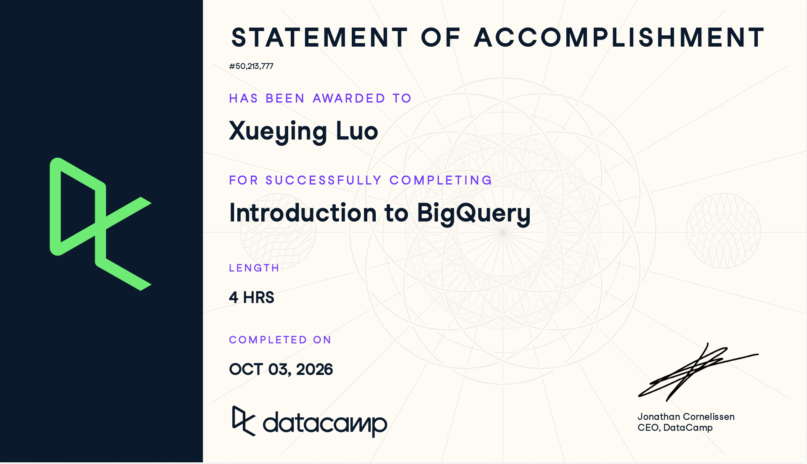

# Course-Completion Evidence

{#fig-certification}

I completed the DataCamp Introduction to BigQuery course on Oct 2, 2026. This certificate (@fig-certification) confirms my completion of the assigned course through the IBM 6500 DataCamp classroom.

# Learning Notes and Key Takeaways

## Chapter 1: BigQuery Architecture and Structure

### Main Ideas

BigQuery is a cloud data warehouse designed for analyzing large datasets. It is mainly used for analytical queries rather than individual transactions. One important feature is that BigQuery separates storage from computing, which allows each part to scale independently.

BigQuery organizes data as: Project –\> Dataset –\> Table

The main architecture components introduced in the course were:

- Colossus and Capacitor for storage.
- Dremel, mixers, slots, execution trees, and leaf nodes for query execution.
- Jupiter and Borg for computing and infrastructure.

BigQuery datasets are also connected to geographic locations or regions. Data that needs to be queried together should generally be stored in compatible locations.

### Important Terminology and Procedures

::: panel-tabset
## Colossus

BigQuery's distributed storage system.

## Capacitor

The columnar format BigQuery uses to store data.

## Dremel

The system used to execute analytical queries.

## Dataset

A container that organizes related BigQuery tables.

## Table

A structure containing rows, columns, and a schema.
:::

### Important SQL Syntax

``` sql
SELECT column_name
FROM dataset_name.table_name;
```

A BigQuery table can be referenced using its dataset and table name.

### SQL Example

``` sql
SELECT DISTINCT seller_city
FROM ecommerce.ecomm_sellers;
```

- This query retrieves unique seller cities from the `ecomm_sellers` table.
- `ecommerce` is the dataset.
- `DISTINCT` removes duplicate cities from the result.

### CEP Application

BigQuery could help organize different types of CEP data into related tables. For example, website pages, search-performance data, engagement data, and leads could be stored separately and connected when needed. For my AO, this could make it easier to compare website content gaps with available search or engagement information.

------------------------------------------------------------------------

## Chapter 2: Writing Queries and Data Types

### Main Ideas

BigQuery uses GoogleSQL, which includes familiar SQL commands such as `SELECT`, `WHERE`, `JOIN`, `GROUP BY`, and `ORDER BY`.

This chapter also introduced data ingestion, date and time functions, arrays, and nested data.

BigQuery supports several file formats, including:

- CSV
- JSON
- Avro
- Parquet
- ORC

Date and time types include:

- `DATE`
- `TIME`
- `DATETIME`
- `TIMESTAMP`

I also learned that BigQuery can store arrays and nested records. `UNNEST()` can expand an array into separate rows so that the values inside it can be analyzed.

### Important SQL Syntax

#### Extract a Date Part

``` sql
EXTRACT(MONTH FROM timestamp_column)
```

#### Add or Subtract Time

``` sql
TIMESTAMP_ADD(timestamp_value, INTERVAL 7 DAY)

TIMESTAMP_SUB(timestamp_value, INTERVAL 7 DAY)
```

#### Expand an Array

``` sql
UNNEST(array_column)
```

### SQL Examples

#### Example 1: Find Orders in September

``` sql
SELECT
    COUNT(order_id)
FROM ecommerce.ecomm_order_details
WHERE EXTRACT(MONTH FROM order_purchase_timestamp) = 9;
```

- `EXTRACT()` retrieves the month from the timestamp.
- The query counts orders where the month is September.

#### Example 2: Expand Nested Order Items

``` sql
SELECT
    order_id,
    items.price
FROM ecommerce.ecomm_orders,
UNNEST(order_items) items;
```

- `UNNEST()` expands the `order_items` array.
- `items.price` retrieves the price stored inside each item.

### CEP Application

Date functions could help me compare digital marketing performance across different weeks, months, or campaign periods. `UNNEST()` may also be useful if I later work with GA4 exports because analytics data can contain nested or repeated fields.

------------------------------------------------------------------------

## Chapter 3: Querying Data in BigQuery

### Main Ideas

This chapter introduced common table expressions (CTEs), special aggregate functions, and window functions. A CTE uses `WITH` to create a temporary result that can be used later in the same query. I found CTEs useful because they make longer queries easier to organize.

Important aggregate functions included:

- `COUNTIF()`
- `ANY_VALUE()`
- `LOGICAL_AND()`
- `LOGICAL_OR()`
- `STRING_AGG()`
- `ARRAY_CONCAT_AGG()`

BigQuery also provides approximate functions such as:

- `APPROX_COUNT_DISTINCT()`
- `APPROX_QUANTILES()`
- `APPROX_TOP_COUNT()`
- `APPROX_TOP_SUM()`

Window functions calculate values across related rows without grouping them into one final row. Examples include:

- `RANK()`
- `LAG()`
- `LEAD()`

### Important SQL Syntax

#### CTE

``` sql
WITH cte_name AS (
  SELECT ...
)
SELECT *
FROM cte_name;
```

#### Window Function

``` sql
RANK() OVER(
  ORDER BY column_name DESC
)
```

#### Rolling Window

``` sql
ROWS BETWEEN 9 PRECEDING AND CURRENT ROW
```

### SQL Examples

#### Example 1: Use a CTE

``` sql
WITH orders AS (
  SELECT
      order_id,
      items.product_id,
      items.price
  FROM ecommerce.ecomm_orders,
       UNNEST(order_items) items
  WHERE items.price > 100
)

SELECT *
FROM orders;
```

- The CTE creates a temporary `orders` result.
- It keeps only items with a price above 100.
- The final query uses the prepared result.

#### Example 2: Rank Customers

``` sql
SELECT
    customer_id,
    all_items,
    RANK() OVER(
      ORDER BY all_items DESC
    ) AS spending_rank
FROM orders;
```

- `RANK()` assigns a ranking based on total spending.
- `OVER()` defines how the ranking is calculated.

### CEP Application

CTEs could help me separate different stages of my CEP analysis. For example, I could prepare website-page data in one CTE and search-performance data in another before combining them. Window functions could also help identify trends over time or rank pages, keywords, or campaigns based on performance.

------------------------------------------------------------------------

## Chapter 4: Data Management and Optimization

### Main Ideas

This chapter introduced different join types, Data Manipulation Language (DML), and query optimization.

The main join types were:

- `INNER JOIN`: keeps matching rows from both tables.
- `LEFT JOIN`: keeps all rows from the left table.
- `RIGHT JOIN`: keeps all rows from the right table.
- `FULL OUTER JOIN`: keeps matching and nonmatching rows from both tables.
- `CROSS JOIN`: combines rows and can be used with `UNNEST()`.

DML statements change data stored in a table.

Important statements include:

- `INSERT`
- `UPDATE`
- `DELETE`
- `MERGE`

Another important topic was query optimization. BigQuery works more efficiently when a query reads only the data that is actually needed.

### Important SQL Syntax

#### Join Using a Shared Column

``` sql
JOIN table_name
USING (order_id)
```

#### Cross Join with an Array

``` sql
CROSS JOIN UNNEST(order_items)
```

#### Update Data

``` sql
UPDATE table_name
SET column_name = value
WHERE condition;
```

### SQL Examples

#### Example 1: Select Only Required Columns

``` sql
SELECT
    order_id,
    payment_type
FROM ecommerce.ecomm_payments
LIMIT 10;
```

- This query selects only the columns needed.
- Avoiding `SELECT *` can reduce the amount of data BigQuery processes.

#### Example 2: Analyze Payment Installments

``` sql
SELECT
    p.payment_installments,
    APPROX_COUNT_DISTINCT(p.order_id),
    AVG(p.payment_value) / p.payment_installments
      AS avg_installment_value
FROM ecommerce.ecomm_payments p
JOIN ecommerce.ecomm_order_details o
USING (order_id)
WHERE p.payment_installments > 0
GROUP BY p.payment_installments;
```

- The query joins payment and order data.
- It groups results by the number of installments.
- `APPROX_COUNT_DISTINCT()` estimates the number of unique orders.
- It also calculates the average payment amount per installment.

### CEP Application

Different join types could help me combine CEP data without accidentally removing important records. For example, a `LEFT JOIN` could keep all website pages from my content audit even if some pages do not have matching Google Analytics or Search Console data. Query optimization would also be useful when working with larger marketing datasets. I could select only the variables, dates, locations, or pages that are relevant to my AO instead of processing unnecessary data.

# Overall Reflection and Future Reference

The most useful concepts I learned were BigQuery's architecture, nested data with `UNNEST()`, CTEs, window functions, joins, and query optimization. BigQuery is different from learning SQL syntax alone because I also need to think about how data is stored, how queries are processed, dataset locations, nested structures, and how much data a query reads. The concepts I found most challenging were `UNNEST()`, approximate aggregate functions, and window functions. I will probably need to review `RANK()`, `LAG()`, `LEAD()`, rolling windows, and `QUALIFY` again.

For digital marketing and my CEP, BigQuery could help combine website, search, analytics, advertising, and lead data. For my AO, it could help me connect content-audit findings with available search or engagement measures when prioritizing website content gaps. I expect to review these patterns again:

- `EXTRACT()` and timestamp functions;
- `UNNEST()` and arrays;
- CTEs;
- `COUNTIF()` and `HAVING`;
- approximate aggregate functions;
- window functions;
- join types; and
- query optimization.

# Appendix: Publication Links

- [GitHub Repository](https://github.com/Sheilaaa0312/ibm-6500-sql-learning-portfolio)
- [Published Introduction to BigQuery Report](https://sheilaaa0312.github.io/ibm-6500-sql-learning-portfolio/introduction-to-bigquery.html)
