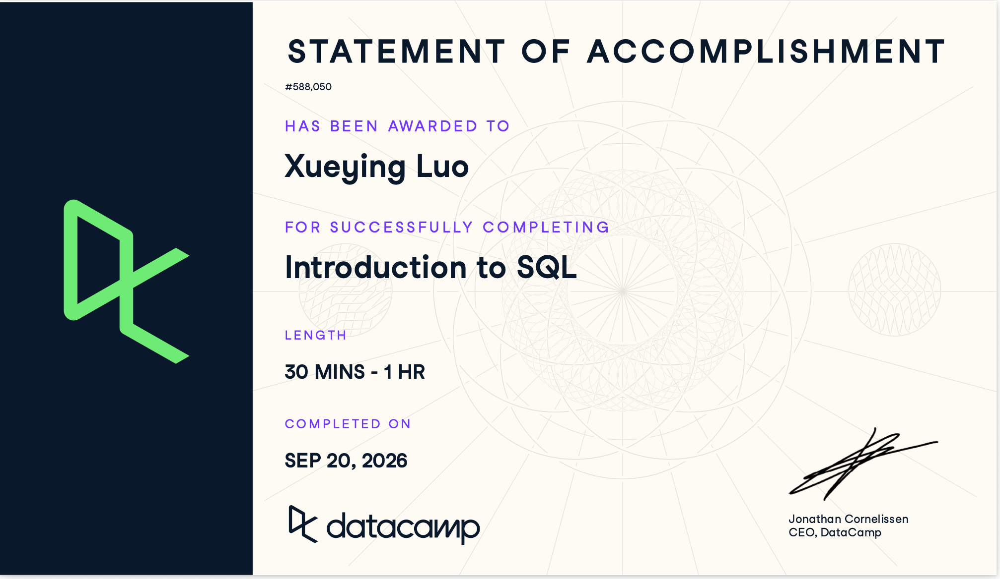
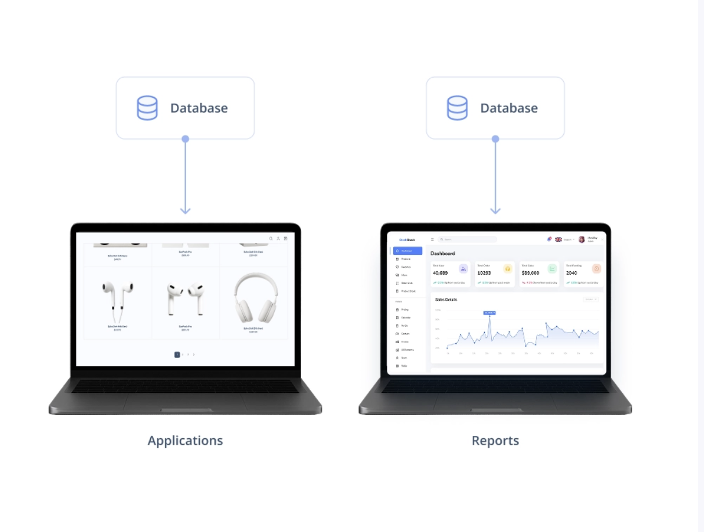
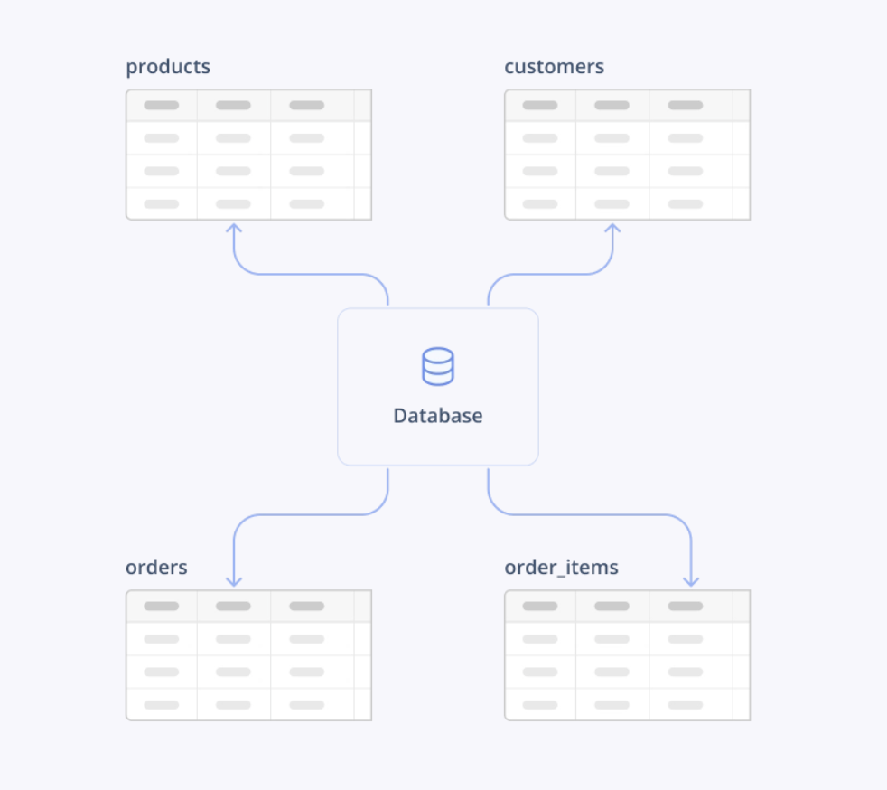

# Course-Completion Evidence

{#fig-certification}

I completed the DataCamp **Introduction to SQL** course on Sep 20, 2026. This certificate confirms my completion of the assigned course through the IBM 6500 DataCamp classroom.

# Learning Notes and Key Takeaways

## Chapter 1: Meet Databases & SQL

### Main Ideas

#### Databases

A database is a system used to manage data. It allows data to be stored reliably, retrieved efficiently, and manipulated in an organized way.



Databases are used by many websites, mobile applications, and software systems. They also support data analysis and reporting. For example, in digital marketing, a database can store information about campaigns, leads, conversions, customers, and marketing channels.

Relational databases organize data into separate tables. Each table usually represents a particular type of entity or event, such as campaigns, customers, products, orders, or leads.



#### Tables, Rows, and Columns

Data in a relational database is organized into tables made up of rows and columns.

- A **row** represents one individual entity, event, or complete record.
- A row may also be called a **record** or **observation**.
- A **column** represents one specific attribute or property.
- A column may also be called a **field** or **attribute**.

For example, in a leads table, one row may represent one lead, while columns may include `lead_id`, `first_name`, `last_name`, `email`, and `country`.

Database tables can look similar to Excel or Google Sheets, but databases are designed to work with much larger amounts of data, support multiple users, and provide data directly to applications.

#### SQL Basics

SQL stands for **Structured Query Language**. It is widely used for working with data stored in databases.

A piece of SQL code used to request information from a database is called a **query**. The database processes the query and returns the requested results.

SQL is more focused than general-purpose programming languages because it is mainly designed for working with data. This makes it useful for retrieving, filtering, organizing, and analyzing information stored in databases.

### Important SQL Syntax

The first chapter mainly introduces the concepts behind SQL. The most important terms introduced were:

- `SQL`: Structured Query Language
- `query`: a request for information from a database
- `table`: a structure that organizes related data
- `row`: one record or observation
- `column`: one attribute or field

### SQL Example

``` sql
SELECT first_name,
       last_name,
       country
FROM leads;
```

- This query requests the `first_name`, `last_name`, and `country` columns from the `leads` table.
- Each row in the result represents one lead, while each selected column represents one specific attribute of that lead.
- This example shows the basic relationship between SQL and a relational database: SQL is used to ask the database for specific information stored in its tables.

### CEP Application

The concepts in this chapter are directly relevant to my CEP because the project involves reviewing and analyzing information from multiple sources, including the PhD Orthodontics website and potentially website analytics, search data, and lead information.

Understanding how databases organize data into tables, rows, and columns helps me think about how different types of CEP data could be structured. For example, one table could contain website pages, another could contain search-performance data, and another could contain lead or engagement information.

A row could represent one website page, one search query, or one lead, while columns could contain attributes such as page title, location, traffic source, impressions, clicks, engagement, or other performance measures.

This basic database structure could help me organize CEP data more systematically before comparing website-content findings with available digital-performance data.

## Chapter 2: Write Your First SQL Queries

### Main Ideas

#### Selecting Columns

The `SELECT` statement is used to choose which columns to retrieve from a table, while `FROM` identifies the table where the data is stored.

A query can return one column, multiple columns, or all columns from a table.

- `SELECT column_1` retrieves one column.
- `SELECT column_1, column_2` retrieves multiple columns.
- `SELECT *` retrieves every column in the table.

For example, if I only need campaign names, I can select the `campaign_name` column instead of returning the entire campaigns table.

#### Sorting Results

The `ORDER BY` clause is used to sort query results based on a specific column.

By default, `ORDER BY` sorts in ascending order.

- Ascending order: lowest to highest, or A to Z.
- Descending order: highest to lowest, or Z to A.

The keyword `DESC` is added when descending order is needed.

Sorting is useful when comparing performance. For example, records can be sorted by impressions, clicks, engagement, or another metric to identify the highest- or lowest-performing results.

#### Limiting Rows

The `LIMIT` clause restricts how many rows are returned by a query.

It is placed at the end of the SQL query.

Using `LIMIT` is useful because it can prevent a query from returning more data than expected. This can make queries faster and reduce the risk of working with unnecessarily large results.

For example, `LIMIT 5` can be used to return only the first five rows produced by the query.

#### Temporary Query Results

Running a `SELECT` query does not change the original database.

The result of a query is a temporary table containing only the data that matches the instructions in the query.

This result is not automatically saved. If I want to keep the result for future use, I need to save it to my computer or cloud storage.

#### Error Handling

SQL syntax needs to be written precisely. Small mistakes, such as misspelled column names, missing punctuation, or incorrect clause placement, can cause a query to fail.

When an error occurs, useful troubleshooting steps include:

- reading the error message carefully;
- checking table and column names;
- checking SQL spelling and syntax;
- reviewing clause order; and
- using a development environment or AI assistance when needed.

With more practice, SQL errors become easier to recognize and fix.

### Important SQL Syntax

#### Selecting One Column

``` sql
SELECT column_1
FROM table_1;
```

#### Selecting Multiple Columns

``` sql
SELECT column_1,
       column_2
FROM table_1;
```

#### Selecting All Columns

``` sql
SELECT *
FROM table_1;
```

#### Sorting in Ascending Order

``` sql
SELECT column_1,
       column_2
FROM table_1
ORDER BY column_1;
```

#### Sorting in Descending Order

``` sql
SELECT column_1,
       column_2
FROM table_1
ORDER BY column_1 DESC;
```

#### Limiting the Number of Rows

``` sql
SELECT *
FROM table_1
LIMIT 10;
```

### SQL Examples

#### Example 1: Return All Campaign Information

``` sql
SELECT *
FROM campaigns;
```

- This query returns every column from the `campaigns` table.
- The `*` symbol means that all available columns should be included in the result.
- In the lesson, this query returned all campaign records and all campaign-related fields, such as campaign ID, campaign name, channel, budget, platform, performance score, and impressions.

#### Example 2: Sort Campaigns by Impressions

``` sql
SELECT campaign_id,
       campaign_name,
       impressions
FROM campaigns
ORDER BY impressions DESC;
```

- This query returns the campaign ID, campaign name, and impressions for each campaign.
- `ORDER BY impressions DESC` sorts the campaigns from the highest number of impressions to the lowest.
- This makes it easier to identify campaigns with the widest reach.

#### Example 3: Find the Ten Lowest-Revenue Conversions

``` sql
SELECT revenue
FROM conversions
ORDER BY revenue
LIMIT 10;
```

- This query selects the `revenue` column from the `conversions` table.
- Because no `DESC` keyword is included, the values are sorted in ascending order, from lowest to highest.
- `LIMIT 10` returns only the first ten rows, which produces the ten conversions with the lowest revenue.

### CEP Application

These SQL skills could support the prioritization stage of my CEP.

My analytics objective is to identify and prioritize website content gaps based on patient information needs, business priorities, SEO opportunities, and available performance data. SQL could help me retrieve only the variables that are relevant to a specific part of that analysis.

For example, if website or search-performance data are available, I could use `SELECT` to retrieve fields such as page name, location, impressions, clicks, engagement, or lead-related measures.

I could then use `ORDER BY` to identify pages or search terms with relatively high or low performance. This could help me compare quantitative performance patterns with findings from my content audit.

`LIMIT` could also help me focus on a smaller set of priority records, such as the highest-impression pages, lowest-engagement pages, or other records that need closer review.

This would be especially useful because my CEP may use Google Analytics, Google Search Console, keyword/search data, and engagement or lead information to help prioritize content gaps.

## Chapter 3: Complete Your SQL Foundation

### Main Ideas

#### Finding Unique Values

The `DISTINCT` keyword is used to return only unique values from a column and remove duplicate results.

It is placed immediately after `SELECT`.

For example, if the `channel` column contains repeated values such as Display, Search, Email, and Social Media, `DISTINCT` can return each channel only once.

This is useful when I want to understand the different categories that exist in a dataset without seeing repeated values.

#### Column Aliasing

The `AS` keyword is used to give a temporary name to a column in the query result.

An alias changes only the displayed column name. It does not rename the original column in the database.

Aliases are useful because they make query results easier to read and understand.

Good aliases should be:

- descriptive;
- consistent;
- easy to understand; and
- written in `snake_case`.

For example, the column `channel` can be displayed as `unique_channels`.

#### SQL Style Conventions

SQL keywords can be written in uppercase or lowercase, but a common convention is to write keywords in uppercase.

Examples include:

- `SELECT`
- `FROM`
- `DISTINCT`
- `AS`
- `ORDER BY`
- `LIMIT`

Using uppercase keywords makes SQL code easier to scan because the commands stand out from table names and column names.

#### SQL Flavors

Different database systems use slightly different versions, or flavors, of SQL.

The core concepts are similar across systems, but some syntax may differ.

Examples of database systems mentioned in the lesson include:

- BigQuery;
- PostgreSQL;
- MySQL;
- SQL Server; and
- Snowflake.

For example, BigQuery, PostgreSQL, and MySQL can use `LIMIT 10`, while SQL Server commonly uses `TOP(10)`.

The important idea is that SQL knowledge transfers well across systems because the main concepts and structure remain similar.

#### Client-Server Architecture

A database system often follows a client-server architecture.

The **database server** stores and manages the database and processes queries.

The **database client** is the software or interface used to connect to the database server, send SQL queries, and display the returned results.

For BigQuery, the BigQuery web console can act as the client interface.

Multiple users or tools can connect to the same database server, depending on their access permissions.

### Important SQL Syntax

#### Return Unique Values

``` sql
SELECT DISTINCT column_name
FROM table_name;
```

#### Create a Column Alias

``` sql
SELECT column_1 AS alias_name,
       column_2
FROM table_1;
```

#### Combine `DISTINCT` and `AS`

``` sql
SELECT DISTINCT column_name AS alias_name
FROM table_name;
```

### SQL Examples

#### Example 1: Find Unique Marketing Channels

``` sql
SELECT DISTINCT channel
FROM campaigns;
```

- This query returns each unique value from the `channel` column in the `campaigns` table.
- Without `DISTINCT`, the same channel could appear multiple times because many campaigns may use the same marketing channel.
- With `DISTINCT`, each channel is returned only once.

#### Example 2: Rename the Unique Channel Column

``` sql
SELECT DISTINCT channel AS unique_channels
FROM campaigns;
```

- This query returns the same set of unique channels, but the output column is displayed as `unique_channels`.
- The alias improves readability and makes it clearer that the result contains unique marketing channels.
- The original `channel` column in the database is not changed.

#### Example 3: Find Unique Lead Countries

``` sql
SELECT DISTINCT country AS lead_countries
FROM leads;
```

- This query returns each unique country from the `leads` table.
- The alias `lead_countries` makes the output easier to understand in a report.
- This could help identify the geographic markets represented in a lead database.

### CEP Application

`DISTINCT` could be useful in my CEP for identifying the categories that exist in website, search, or lead data before I begin comparing performance.

For example, I could use `DISTINCT` to identify:

- unique website locations;
- unique service-page categories;
- unique search queries or keyword groups;
- unique traffic sources;
- unique landing pages; or
- unique geographic areas.

This may be particularly useful because my project includes location-specific content and recognizes that the same content priorities may not apply equally to San Gabriel and Chino Hills.

Aliases using `AS` could also make outputs easier to understand when I prepare tables or results for the group. For example, a column could be renamed to `unique_locations`, `service_pages`, or `traffic_sources` without changing the original database.

These techniques could help me organize data before comparing it with my structured content audit. My progress report proposes evaluating whether important information is present, understandable, reliable, and useful for patient decisions, then using SEO and available engagement or lead data to help prioritize the identified gaps.

# Overall Reflection and Future Reference

The most useful skills I learned in this course were using `SELECT` to retrieve specific information, `ORDER BY` to rank results, `LIMIT` to focus on a smaller set of records, `DISTINCT` to identify unique categories, and `AS` to create clearer output names. These commands showed me how SQL can reduce a large dataset to the specific records and variables needed to answer a question.

The concepts I found most challenging were remembering the correct order of SQL clauses and understanding how several commands work together in one query. I also needed some practice deciding when ascending or descending sorting was appropriate. Another important concept was learning that a `SELECT` query creates a temporary result and does not change the original database, which makes it useful for exploring data safely.

The course also helped me see how SQL could fit into my CEP. My project focuses on evaluating PhD Orthodontics’ existing website content and identifying content gaps across services and locations. The gaps will ultimately be prioritized using patient information needs, business priorities, SEO opportunities, and available performance data.

If the relevant data become available, SQL could help me work with sources such as Google Analytics, Google Search Console, search and keyword data, and engagement or lead information. For example, I could select specific page-level or search-level variables, sort records by performance measures, identify unique page or location categories, and narrow the results to records that require closer review.

This could help connect quantitative digital-performance data with my patient-centered content audit. My current approach is to treat content quality and patient information needs should be evaluated separately, while SEO and performance data can help prioritize which gaps deserve attention.

I also need to be careful not to assume that better website content will automatically create more consultation inquiries. My current CEP evidence supports using website content to improve patient information and provider evaluation, but it does not establish a direct causal relationship between improved content and consultation behavior.

In the future, I expect to review `SELECT`, `ORDER BY`, `LIMIT`, `DISTINCT`, and `AS`, especially when I need to combine several clauses in one query. I also expect to review SQL syntax and continue learning BigQuery and more advanced SQL techniques, because later commands may help me combine website, search, engagement, and lead data for more detailed CEP analysis.

# Appendix: Publication Links

- [GitHub Repository](https://github.com/Sheilaaa0312/ibm-6500-sql-learning-portfolio)
- [Published Introduction to SQL Report](https://sheilaaa0312.github.io/ibm-6500-sql-learning-portfolio/introduction-to-sql.html)
